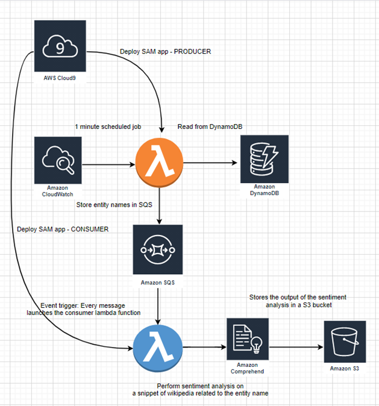

# Serverless-Data-Engineering-Pipeline
This project provides a prototyping schema that deploys a serverless data engineering pipeline on AWS, using SAM Lambda functions, S3, DynamoDB, SQS and Cloudwatch.

# Overview
* First, we created a table in **DynamoDB** called "fang". This table has only one column: name.

* Then, we deployed a **lambda function** using the SAM framework, *producer* to read the data from the table in **DynamoDB** and send it to **SQS**, which is a messaging service that stores messages/event for consumption by other AWS services. This lambda will be triggered using **Cloudwatch events**, which will get triggered every minute once it is enabled.

* Once the data gets into **SQS**, another **lambda function**, *consumer*, will get the messages from the **SQS** queue, read them and send to **Amazon Comprehend** for sentiment analysis. The analyzed sentiment, along the original review and id will be saved in csv file and send to **S3** bucket.

## Architecture of the serverless Data Engineering Pipeline

### Reference Links:

[Amazon Web Service (AWS)](https://aws.amazon.com)
[Amazon S3](https://aws.amazon.com/s3/)   
[AWS Lambda](https://aws.amazon.com/lambda/)    
[Amazon DynamoDB](https://aws.amazon.com/dynamodb/)    
[Amazon Cloudwatch](https://aws.amazon.com/cloudwatch/)    
[Amazon Simple Queue Service (SQS)](https://aws.amazon.com/sqs/)   
[AWS Comprehend](https://aws.amazon.com/comprehend/).
